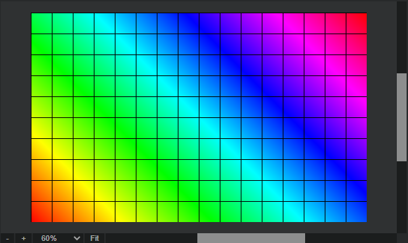

# Pannable zoomable area with scrollbars

Pannable and zoomable area with scrollbars inspired by graphical editors like Photoshop.



## Setup:

**HTML:**

```html
<div id="myEditor">
    <div class="zoompan-viewport">
        <div class="zoompan-canvas"></div>
    </div>

    <div class="zoompan-track-x">
        <div class="zoompan-thumb-x"></div>
    </div>
    <div class="zoompan-track-y">
        <div class="zoompan-thumb-y"></div>
    </div>
</div>
```

**CSS:**

```html
<link rel="stylesheet" href="zoompan.css">
```

**JS:**

```
import ZoomPan from "./zoompan.js";
const ZP = new ZoomPan("#myEditor");
```

## Options object

| Name          | Type            | Default value | Description                   |
| ------------- | --------------- | ------------- | ----------------------------- |
| `elParent`    | String\|Element |               | **Mandatory** Wrapper element |
| `width`       | Number          | `800`         | Canvas width                  |
| `height`      | Number          | `600`         | Canvas height                 |
| `offsetX`     | Number          | `0`           | Canvas offset X (from center) |
| `offsetY`     | Number          | `0`           | Canvas offset Y (from center) |
| `scaleFactor` | Number          | `0.2`         | Scale factor                  |
| `scaleMin`    | Number          | `0.05`        | Scale min value               |
| `scaleMax`    | Number          | `10`          | Scale max value               |
| `padd`        | Number          | `40`          | Min visible canvas padd       |

## Options object &mdash; Events

| Name                | Description                      |
| ------------------- | -------------------------------- |
| `onInit()`          | Triggered on class instantiation |
| `onScale(Event)`    | Triggered on scale change        |
| `onPan(Event)`      | Triggered on pan (pointermove)   |
| `onPanStart(Event)` | Triggered on pan (pointerdown)   |
| `onPanEnd(Event)`   | Triggered on pan (pointerup)     |

## Properties

| Name       | Type   | Description                |
| ---------- | ------ | -------------------------- |
| `scaleOld` | Number | Scale value before changed |


## Methods

| Name                                  | Returns               | Description                                |
| ------------------------------------- | --------------------- | ------------------------------------------ |
| `panTo(offsetX, offsetY)`             |                       | Pan canvas to new offset (from center)     |
| `scaleTo(scale [, originX, originY])` |                       | Scale canvas to value (origin from center) |
| `scaleUp()`                           |                       | Scale up by `scaleFactor`                  |
| `scaleDown()`                         |                       | Scale down by `scaleFactor`                |
| `scaleDelta(delta)`                   |                       | Scale by delta                             |
| `fit()`                               |                       | Fit canvas to viewport center (*contain*)  |
| `updateScrollbars()`                  |                       | Reposition and resize scrollbars           |
| `getCanvas()`                         | {x, y, width, height} | Get Canvas data                            |
| `getViewport()`                       | {x, y, width, height} | Get Viewport data                          |
| `getArea()`                           | {width, height}       | Get fictive *"scroll area"* size           |
| `calcScaleDelta(delta)`               | Number                | Calculate scale by delta                   |

## Example

See: `example.html` for a use-case.

### Licence

MIT
